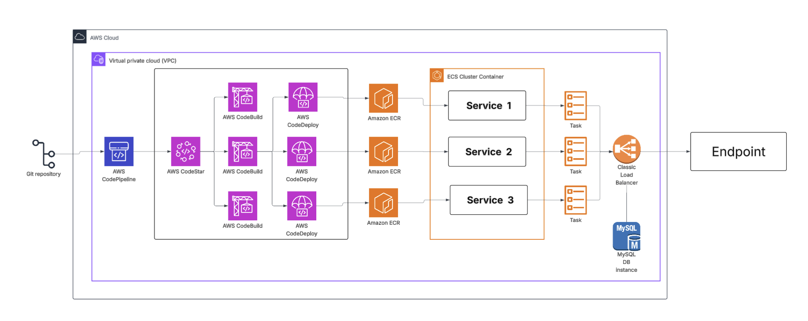

# Ecomm Project

## Overview
Ecomm is a comprehensive e-commerce platform designed to facilitate online shopping experiences. The project is structured into multiple modules, each serving a specific purpose within the e-commerce ecosystem. This README provides an overview of the project structure, its components, and instructions for setting up the environment variables.

## Project Structure

```
/Users/ajithrajs/Java/ecomm
├── ecommadmin
│   ├── src
│   │   ├── main
│   │   │   ├── java
│   │   │   └── resources
│   │   └── test
│   └── pom.xml
├── ecommauth
│   ├── src
│   │   ├── main
│   │   │   ├── java
│   │   │   └── resources
│   │   └── test
│   └── pom.xml
├── ecommbuyer
│   ├── src
│   │   ├── main
│   │   │   ├── java
│   │   │   └── resources
│   │   └── test
│   └── pom.xml
└── pom.xml
```

### Modules
1. **ecommadmin**: This module handles the administrative functionalities of the e-commerce platform, including user management, product management, and order processing.
2. **ecommauth**: This module is responsible for authentication and authorization, ensuring secure access to the platform.
3. **ecommbuyer**: This module focuses on the buyer's experience, including product browsing, cart management, and checkout processes.

## Environment Variables
To configure the application, you need to set up the following environment variables:

- `DATABASE_URL`: The URL for the database connection.
- `JWT_SECRET`: The secret key used for signing JSON Web Tokens.
- `MAIL_SERVER`: The SMTP server for sending emails.
- `MAIL_PORT`: The port for the mail server.
- `MAIL_USERNAME`: The username for the mail server.
- `MAIL_PASSWORD`: The password for the mail server.

### Updating Environment Variables
1. Create a `.env` file in the root directory of each module (e.g., `ecommadmin`, `ecommauth`, `ecommbuyer`).
2. Add the required environment variables in the following format:
   ```
   DATABASE_URL=your_database_url
   JWT_SECRET=your_jwt_secret
   MAIL_SERVER=your_mail_server
   MAIL_PORT=your_mail_port
   MAIL_USERNAME=your_mail_username
   MAIL_PASSWORD=your_mail_password
   ```
3. Ensure that the `.env` file is included in your `.gitignore` to prevent sensitive information from being committed to the repository.

## Running the Project
To run the project, navigate to the desired module directory and execute the following command:
```bash
./mvnw spring-boot:run
```

## Cloud Deployment

Architecture Overview
---------------------

The deployment follows this workflow:

Developer → GitHub → AWS CodePipeline → AWS CodeBuild → Amazon ECR → ECS (Fargate) → ALB




Local Development & Dockerization
-------------------------------------

### Prerequisites

*   **Java:** 17 (Eclipse Temurin)

*   **Port:** 8081

*   **Profiles:** prod


### Build and Run Locally

```
1.  Bashmvn clean package -DskipTests

2.  Bashdocker build -t ecommauth:latest .

3.  Bashdocker run -p 8081:8081 ecommauth:latest

4.  Bashcurl http://localhost:8081/actuator/health# Expected: {"status":"UP"}
```

Infrastructure Setup
------------------------

### Amazon ECR

Create the repository to host your Docker images:

```
aws ecr create-repository --repository-name ecommauth --region us-east-1
```

### ECS Task Definition (Fargate)

*   **CPU:** 512 | **Memory:** 1024

*   **Network Mode:** awsvpc

*   **Port Mapping:** 8081 (TCP)

*   **Logging:** AWSLogs to /ecs/ecommauth


### Application Load Balancer (ALB)

| Setting              | Value            |
|----------------------|------------------|
| Target Type          | IP               |
| Protocol / Port      | HTTP / 8081      |
| Health Check Path    | /actuator/health |
| Health Grace Period  | 90 Seconds       |


Manual ECR Push (Initial Setup)
-----------------------------------

To push your first image manually:

### Authenticate  
```
aws ecr get-login-password --region us-east-1 | docker login --username AWS --password-stdin .dkr.ecr.us-east-1.amazonaws.com
```  
### Tag and Push  
``` 
docker tag ecommauth:latest .dkr.ecr.us-east-1.amazonaws.com/ecommauth:latest  docker push .dkr.ecr.us-east-1.amazonaws.com/ecommauth:latest
```

CI/CD Pipeline Configuration
--------------------------------

The pipeline is automated via CodePipeline using the following buildspec.yml stages:

### Build Stages:

1.  **Pre-Build:** Log in to ECR and generate image tags using the Git commit hash.

2.  **Build:** Run Maven package and build the Docker image.

3.  **Post-Build:** Push the image to ECR and create imagedefinitions.json for ECS deployment.


### Deployment Configuration:

*   **Provider:** Amazon ECS

*   **Input Artifact:** imagedefinitions.json

*   **Deployment Style:** Rolling Update


Verification
----------------

To verify the deployment status via CLI:

```
aws ecs describe-services \    
--cluster  \    
--services ecommauth-service
```

**Final Production Health Check:**


```
curl http:///actuator/health   
```

## Conclusion
This README provides a high-level overview of the Ecomm project and instructions for setting up the environment variables. For further details on each module, please refer to the respective module documentation.
